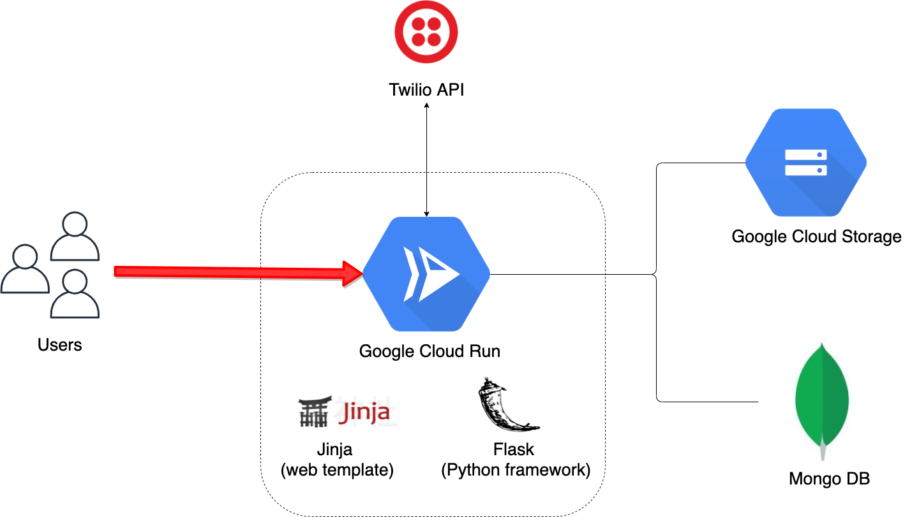

# SMS marketing platform 📱


[](https://opensource.org/licenses/MIT)
[](https://circleci.com/gh/Pierre-Alexandre35/messaging-service-mousset)

[](https://codecov.io/gh/Pierre-Alexandre35/messaging-service-mousset)

## Contents
- [Description](#Description)
- [Architecture](#Architecture)
- [Project Context](#Project-Context)
- [Installation](#Installation)
- [Change Log](CHANGELOG.md)


## Description
Platform to send text messages to individuals or groups of customers in 1 click. Features:
- Create "customers" groups (uk-customers, young-customers, ...)
- Add, remove, modify a customer to the database 
- Instant and accurate campaign cost estimating 
- Live Twilio account balance ($)
- Overview of all previous campaigns (delivery status, message content, cost, date)
- Consult and download your Twilio bills 


## Architecture


<br />
- Front-End: Jinja2 / Bootstrap / HTML
- Back-End: Flask / Python 
- Database: MongoDB 
- Hosting: Cloud Run (Google Cloud Platform)
- CI/CD: CircleCI


## Project Context
My parents own a small clothes shop in a tinny village in France. Since 2018, they are reaching their customers with text-message marketing campaigns. Howvwer, they had to face a lot of different problems that this app is trying to solve:
1) Limited: most mobile service providers are limiting the number of recipients for texting (often to 200 per month)
2) Time-consuming: it took my parents few hours to text their 800 customers and figure out which recipients did not get the message due to limitations
3) Unsecured: the only place where they had customer-related informations stored was a single Android smarphone. What about if they lose it? 

My goal was to build a easy-to-use tool for them to let them text their customers in one click and set up a "real" database:
- I exported Android contacts to .csv using Coolmuster Android Assistant
- Built a small ETL (Extract, Transform, Load) pipeline in Python to load data from .csv to MongoDB 
- Created a Flask / Python app to display all records (customers) from the database 
- Set up a Twilio business account and obtain a french phone number (+33) with SMS capacity
- Created a endpoint with a html-form to send a text-message to every users using Twilio Messaging API 


## Installation 

1. Clone repository

```git clone https://github.com/Pierre-Alexandre35/messaging-service-mousset```
<br>

2. Create an isolated virtual python environment

```virtualenv dev-env```
<br>

3. Install project dependencies

```pip3 install -r requirements.txt```
<br>


4. Set up your environment configuration

Open ```config/environments/demo.env``` and load the 4 required environment variables


| variable  | description | example |
| ------------- |:-------------:|:-------------|
| MONGO_URI | Connection string between app and MongoDB |```mongodb+srv://<USERNAME>:<PASSWORD>@cluster0.fut2y.mongodb.net/```<br>```<DATABASE>?ssl=true&ssl_cert_reqs=CERT_NONE```
| TWILIO_SID     | Twilio 34-digit Application SID     | link
| TWILIO_TOKEN      | Twilio auth token     | link 
| TWILIO_PHONE_NUMBER      | Twilio international phone number    | +33750218304
| FLASK_SECRET      | Flask secret for session management     | any string 


4. Run your application

```flask run```


## Roadmap
- Add Twilio balance $ on the navar  
- Single page to create, delete or modify list of customers (global list, testing list...)
- Stronger forms validators to add a new customer 


## Others
https://github.com/chriswilson1982/flask-mongo-app
https://github.com/punkdata/python-flask/blob/master/.circleci/config.yml
